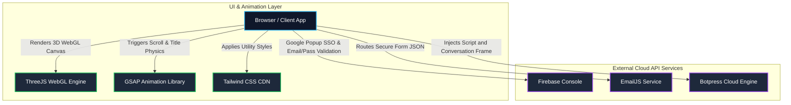
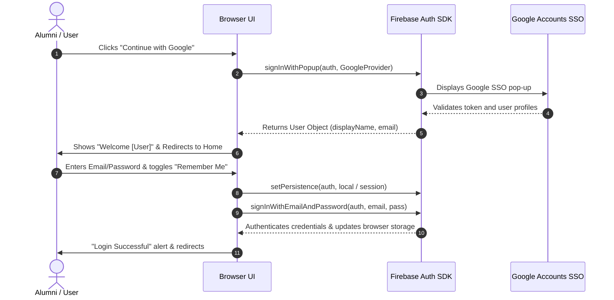
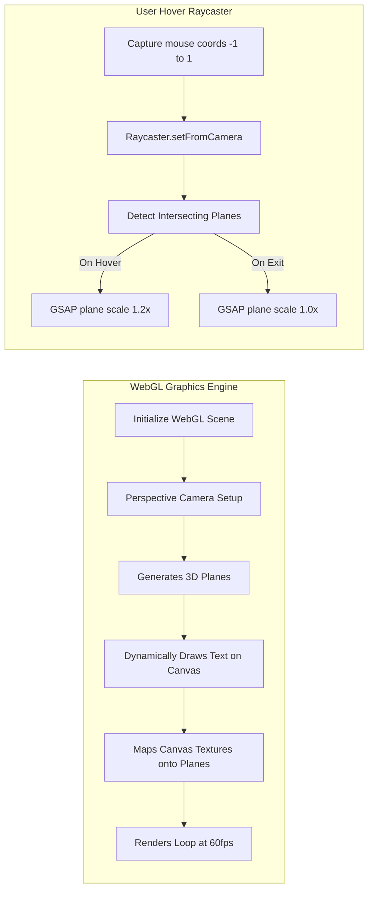
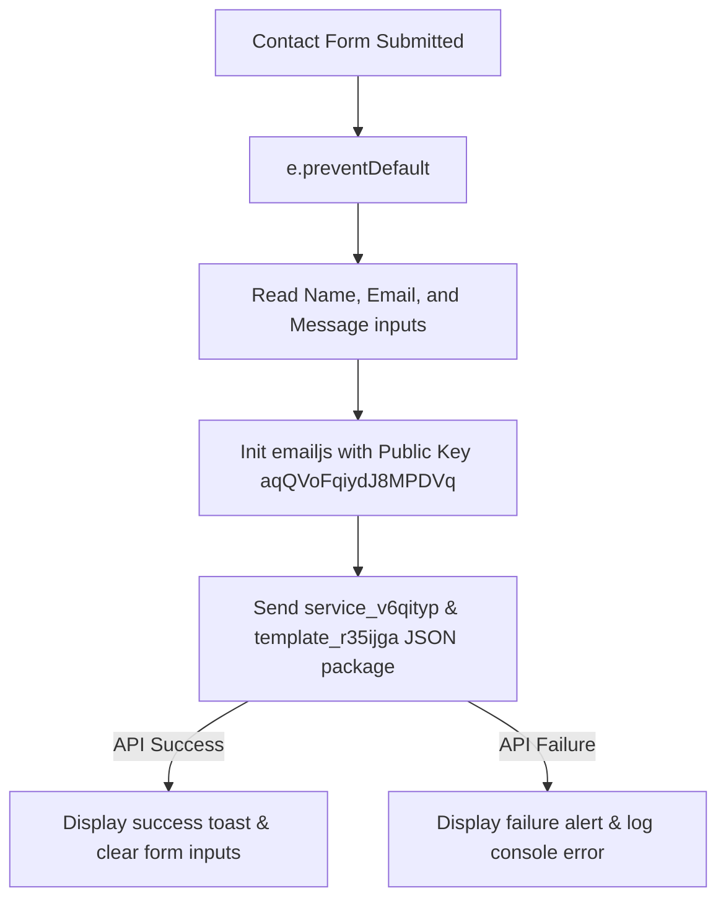

# 🏗️ Technical Architecture & Design Document
> Technical specification of the GVHS Alumni Portal's client-side subsystems, external integrations, data pipelines, and design methodologies.

---

## 🗺️ High-Level System Architecture

The current GVHS Alumni Portal operates on a **Decentralized Static Client-Side Architecture (JAMstack)**. All rendering, style applications, and animations occur directly on the client's browser, offloading database storage, account management, conversational agents, and messaging alerts to industry-standard external cloud services.

Below is an architectural diagram visualizing how these components interact:

---

## 📂 Core Component Interactions

### 1. Unified Authentication Subsystem (Firebase Auth)
The portal provides secure user registration, email validation, credentials checking, and **Google Single Sign-On (SSO)** inside [login.html](login.html) and [register.html](register.html).

#### Logical Workflow:

- **Persistence Strategies:**
  - **Local Persistence (`browserLocalPersistence`):** Used when the user selects `Remember Me`. Auth state is stored in LocalStorage, surviving browser closes.
  - **Session Persistence (`browserSessionPersistence`):** Auth state is stored in SessionStorage, expiring as soon as the browser tab is closed.

---

### 2. Interactive 3D Sponsor Sphere (Three.js & GSAP)
The [Sponsor Page](sponsors.html) features a premium 3D canvas displaying floating partners.

- **Canvas-to-Texture Pipeline:**
  To dynamic-render sponsor text inside 3D space without heavy assets, a 2D HTML5 `<canvas>` is instantiated dynamically for each partner. The browser renders a rounded rectangle containing standard text, converts it into a `THREE.CanvasTexture`, and assigns it to a `THREE.MeshBasicMaterial` loaded onto a `THREE.PlaneGeometry`.
- **GSAP Position & Rotation Drifts:**
  To give a floating, organic effect, GSAP animates the coordinate vector parameters (`x`, `y`, `z`) of each plane using a sinusoidal curve (`ease: "sine.inOut"`) over a slow 20-second interval, yoyo-ing infinitely. A steady rotation drift is applied simultaneously.
- **WebGL Interactivity:**
  An intersection checking loop (`raycaster.intersectObjects`) uses the client mouse coordinates. Hovered elements expand in scale (1.2x) via GSAP while surrounding elements remain static, creating an extremely premium user experience.

---

### 3. Serverless Form Pipeline (EmailJS Integration)
The [Contact](contact.html) form bypasses custom backend servers by communicating directly with the **EmailJS** API:

- **No-Backend Middleware:** Inputs are bundled into a JSON configuration payload mapping form keys (`name`, `email`, `message`) to Template Variables. The client SDK makes a POST request to EmailJS endpoints, triggering automated transactional mail templates.

---

### 4. Conversational Support Engine (Botpress Cloud)
An automated assistant is integrated via external client scripts injected onto every page:
- **Injection Scripts:**
  - `inject.js` (Webchat UI widget renderer).
  - Script ID: `20250907004022-71KNQX8E.js` (Context config script containing Golden Valley HS School custom AI prompts, chatbot intents, and greeting schemas).

---

## 🔒 Security Analysis & Measures

1. **Client-Side API Key Visibility:**
   - **Observation:** Firebase configs (Project ID, API key, App ID) and EmailJS Public Keys are hardcoded in plain HTML scripts.
   - **Evaluation:** This is **standard and safe** for serverless apps. Firebase API keys are only project identifiers, not administrative secret keys.
   - **Protection Matrix:**
     - **Firebase Auth:** Restrict OAuth pop-up redirection by going to the Firebase Console and authorizing only trusted domain URLs (e.g., `localhost`, your production domain) under **Authentication > Settings > Authorized Domains**.
     - **EmailJS:** In the EmailJS dashboard, enable **Domain Restrictions** so API requests are rejected unless sent from designated authorized domains.
2. **Contact Spam Rate Limiting:**
   - Currently, no client-side rate limiting is implemented on [contact.html](contact.html).
   - **Recommendation:** Implement a submission cooldown state (e.g., disable the button for 60 seconds post-submission) to prevent continuous script submissions.

---

## 📈 Performance Engineering

- **Asynchronous CDNs:** External libraries (FontAwesome, Botpress, Three.js, GSAP) are loaded asynchronously via `<script defer>` tags to prevent UI render blocking.
- **Tailwind JIT Engine:** For Tailwind-supported pages, the stylesheet JIT compiler (`https://cdn.tailwindcss.com`) is injected. While excellent for prototyping, this requires the browser to parse all CSS classes dynamically at runtime.
- **Visual Asset Optimization:** Image payloads (like `COMINGS OON.png`, `dance.jpg`, `instruments.png`, and background images) range from **400KB to 1.4MB**. 
  - **Optimization Required:** Images should be compressed, resized, and converted into modern responsive file formats like **WebP** or **AVIF** to reduce initial page load times by up to **80%**.
